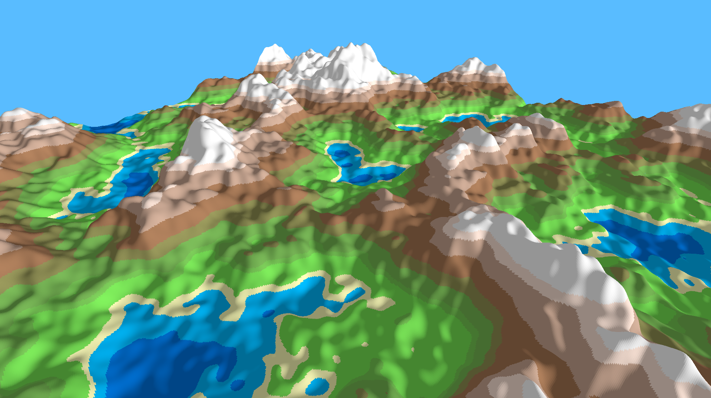

# Vulkan Terrain Generator
A low-poly terrain generator made with C++17/Vulkan.  
This is my first major project with Vulkan.  
The chunk management is horribly optimised and only done on a single thread; however the purpose of this project was to get a Vulkan renderer with basic terrain. The chunking and infinite generation was a last-second addition.  
I may optimise it in the future, but for now, enjoy the frame skips. :P

## Dependencies
* [SDL2](https://www.libsdl.org/download-2.0.php)
* [Vulkan SDK](https://www.lunarg.com/vulkan-sdk/)
* [GLM](https://glm.g-truc.net/0.9.9/index.html)
* [SPIR-V Cross](https://github.com/KhronosGroup/SPIRV-Cross)
* [Vulkan Memory Allocator](https://github.com/GPUOpen-LibrariesAndSDKs/VulkanMemoryAllocator)
* [STB Image](https://github.com/nothings/stb)
